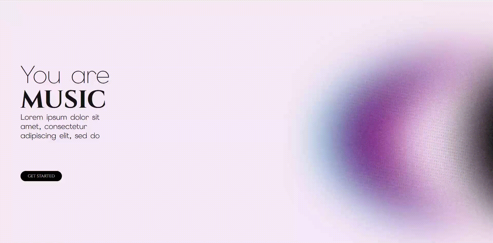
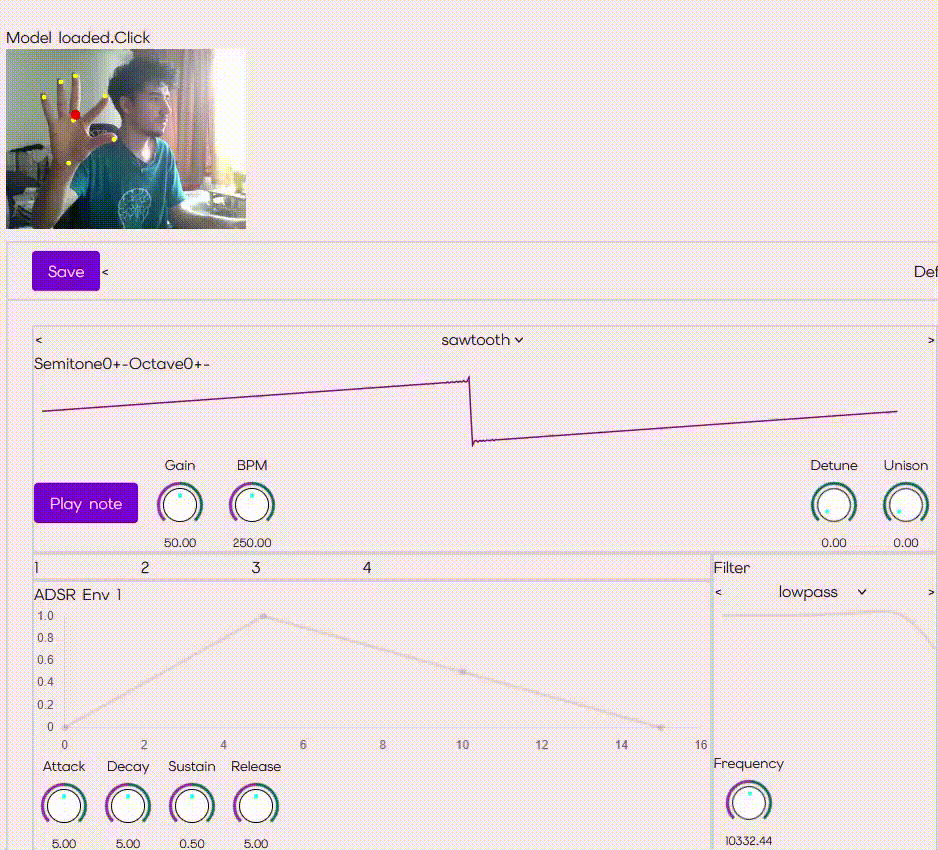
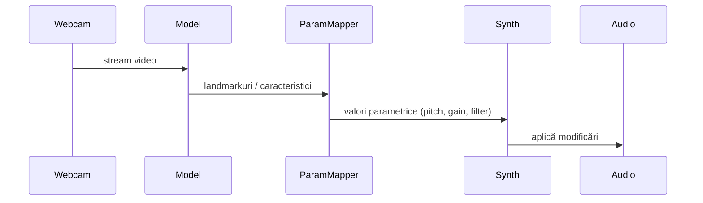

# YouAreMusic
Interfață muzicală Web: controlul parametrilor audio prin detecția vizuală a mâinii.

YouAreMusic este o aplicație web modernă care transformă mișcările mâinii în control live pentru sintetizatoare și efecte audio. Proiect realizat ca lucrare de licență la Facultatea de Matematică și Informatică, Universitatea din București (2026). Scopul proiectului este să ofere o interfață expresivă, accesibilă și performantă pentru creație muzicală bazată pe vedere computerizată.

[](https://nextjs.org) [](https://reactjs.org) [](https://www.typescriptlang.org) [](https://tailwindcss.com) [](https://developer.mozilla.org/en-US/docs/Web/API/Web_Audio_API) [](https://www.prisma.io) [](https://mediapipe.dev)

**Descriere scurtă a tehnologiilor**
- **Next.js**: framework React pentru aplicații server-rendered și route-uri moderne — folosit pentru structura paginilor și API routes.
- **React**: bibliotecă UI reactivă — folosită pentru componentele interfeței și gestionarea stării.
- **TypeScript**: superset JavaScript cu tipare — oferă siguranță la build și claritate în cod.
- **Tailwind CSS**: utilitare CSS pentru styling rapid și consistent.
- **WebAudio API**: API browser pentru sinteză și procesare audio în timp real — motorul audio al aplicației.
- **Prisma**: ORM TypeScript pentru acces la baza de date — folosit pentru persistența preseturilor și a utilizatorilor.
- **MediaPipe / model detectare**: pipeline ML pentru detectarea și extragerea landmark-urilor mâinii — folosit pentru inputul gestural.

**Ce vinde acest proiect**: o experiență intuitivă pentru muzicieni și creatori multimedia, care combină detectarea avansată a mișcării mâinii, sinteză audio în browser și o arhitectură scalabilă pentru extinderi viitoare.

--

**Conținut**
- **Overview**: scop, public țintă și valoare adăugată
- **Funcționalități principale**
- **Arhitectură și diagrame**
- **Setup & Rulare locală**
- **Utilizare**
- **Contribuire**
- **Resurse și referințe**

--

**Demo vizual**
- Interfața principală: pagina [app/page.tsx](you-are-music/app/page.tsx)
- Controlul sintetizatorului: [you-are-music/app/synth/page.tsx](you-are-music/app/synth/page.tsx)



**Tehnologii principale**: Next.js, React, TypeScript, Tailwind, WebAudio API, MediaPipe (sau modelul de detectare folosit), Prisma pentru persistență.

**Public țintă**: muzicieni, dezvoltatori multimedia, cercetători în HCI, studenți.

**De ce contează**
- Interacțiune naturală: control expresiv fără hardware dedicat
- Portabilitate: rulează în browser, cross-platform
- Extensibil: module synth, arp, lfo, sampler ușor de adaptat

**Funcționalități (high level)**
- Detectare mișcare mâină în timp real (webcam)
- Mapping flexibil de gesturi la parametrii audio
- Sintetizator polifonic cu ADSR, filtre, LFO, arpegiator și sampler
- Persistență presets cu Prisma
- Interfață responsivă și optimizări pentru latență scăzută

**Arhitectură — diagrame**

Arhitectura de ansamblu (componentă front-end, detecție video, motor audio):

```mermaid
flowchart LR
	A[Webcam] --> B[Detecție Mână (MediaPipe / Model)]
	B --> C[Manager Gesture -> Param Mapping]
	C --> D[Sinteză Audio (WebAudio API)]
	D --> E[Output Audio]
	C --> F[UI Controls & Presets]
	F --> G[Persistență (Prisma / DB)]
```

Fluxul de date pentru controlul parametrilor:



--

**Instalare & rulare locală**

1. Clonează repository-ul:

```bash
git clone <repo-url>
cd you-are-music
```

2. Instalează dependențe (exemplu cu npm):

```bash
npm install
```

3. Setează variabile de mediu (dacă este cazul):

- `DATABASE_URL` — conexiune Prisma (opțional pentru funcționalitate de presets)
- `NEXTAUTH_SECRET` — pentru autentificare (dacă folosești NextAuth)

4. Rulează în modul dezvoltare:

```bash
npm run dev
# deschide http://localhost:3000
```

**Notă despre browser & permisiuni**: Acordă permisiunea de acces la webcam; folosește un browser modern (Chrome, Edge, Firefox). Pentru performanță, preferă o pagină servită prin HTTPS la producție.

--

**Structură relevantă a proiectului**
- `app/` — pagini și layout Next.js
- `app/webcam/webcam.tsx` — componentă webcam
- `app/synth/` și `components/synth/` — logica sintezatorului și controale
- `services/` — control managers și preset store
- `prisma/` — schema și migrații

Vezi fișiere: [you-are-music/app/webcam/webcam.tsx](you-are-music/app/webcam/webcam.tsx), [you-are-music/services/presetStore.ts](you-are-music/services/presetStore.ts)

--

**Utilizare**
1. Accesează interfața principală.
2. Activează webcam-ul și poziționează mâna în fața camerei.
3. Folosește menu-urile pentru a mapa axe la parametri (de ex. sus/jos -> pitch, stânga/dreapta -> filter).
4. Salvează preseturi și experimentează cu arpegiatorul și LFO-urile.

--
